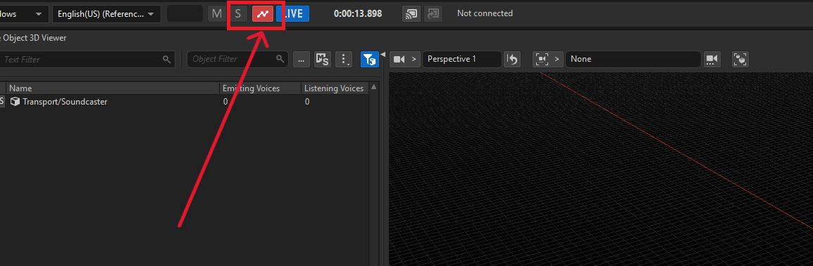

<p align="center">
  
</p>
  
# Model Context Protocol for Wwise

[](https://www.apache.org/licenses/LICENSE-2.0)
[](https://www.audiokinetic.com/en/wwise/)
[]()

</div>

# Wwise-MCP

Wwise-MCP is a Model Context Protocol server that allows LLMs to interact with the Wwise Authoring application. It exposes tools from a custom python waapi function library to MCP clients such as Claude or Cursor.

## 📌 About This Fork

**This repository is a fork of [Bilkent Samsurya's Wwise-MCP](https://github.com/BilkentAudio/Wwise-MCP)**.

This fork extends the original implementation by providing **complete WAAPI coverage** based on **Wwise 2025.1.4.9062**'s WAAPI URI list. All function and topic-type WAAPI commands from the official Wwise 2025.1.4.9062 documentation have been implemented, ensuring comprehensive support for the latest Wwise features and capabilities.

### Key Improvements
- ✅ **Complete WAAPI Implementation**: All functions and topics from Wwise 2025.1.4.9062 WAAPI URI list
- ✅ **Full Feature Coverage**: Support for all command types including functions, topics, and subscriptions
- ✅ **Latest Wwise Compatibility**: Optimized for Wwise 2025.1.4.9062

[Watch the original demo and installation guide on YouTube](https://www.youtube.com/watch?v=d7bVT4yrdmI)

# ⚠️ Experimental Notice

This project is currently in an **EXPERIMENTAL** state. 
It is still under active development and should not be used with Wwise projects intended for production at the moment. Please keep in mind:
- Breaking changes may occur without warning
- Features may be incomplete or unstable
- Documentation may be outdated or missing
- Production use is not recommended at this time
  
# Installation

## Prerequisites
- Install [Claude Desktop](https://www.claude.com/download) or [Cursor](https://cursor.com/download) or any MCP compatible AI platform
- Install [Wwise 2025.1.4.9062+](https://www.audiokinetic.com/en/download/)
- Clone or download this repository

## Setup

> **⚠️ Important**: Unlike the original repository which uses a pre-compiled `.exe` file, this fork requires you to set up a Python virtual environment and configure your MCP client to use Python directly. This gives you more control and allows for easier development and customization.

### Step 1: Python Environment Setup

**This step is required** - you must set up a Python virtual environment before configuring your MCP client.

1. **Navigate to the repository directory**:
```bash
cd path/to/Wwise-MCP
```

2. **Create a virtual environment**:
```bash
python -m venv .venv
```

3. **Activate the virtual environment**:
   - **Windows**: `.venv\Scripts\activate`
   - **macOS/Linux**: `source .venv/bin/activate`

4. **Install dependencies**:
```bash
pip install -r requirements.txt
```

### Step 2: MCP Client Configuration

After setting up the Python environment, you need to configure your MCP client (Claude Desktop or Cursor) to use the Python script directly.

1. **Locate your MCP client's configuration file**:
   - **Claude Desktop**: `%APPDATA%\Claude\claude_desktop_config.json` (Windows) or `~/Library/Application Support/Claude/claude_desktop_config.json` (macOS)
   - **Cursor**: `%APPDATA%\Cursor\User\globalStorage\saoudrizwan.claude-dev\settings\claude_desktop_config.json` (Windows) or `~/Library/Application Support/Cursor/User/globalStorage/saoudrizwan.claude-dev/settings/claude_desktop_config.json` (macOS)

2. **Reference the example configuration**: 
   Open `mcp_example.json` in the root directory of this repository as a template.

3. **Configure your MCP client**:
   Add the following configuration to your MCP client's JSON file, replacing `<REPLACE_WITH_ABSOLUTE_PATH_TO>` with your actual absolute path to the Wwise-MCP directory:

```json
{
  "mcpServers": {
    "wwise-mcp": {
      "type": "stdio",
      "command": "<REPLACE_WITH_ABSOLUTE_PATH_TO>\\Wwise-MCP\\.venv\\Scripts\\python.exe",
      "args": ["<REPLACE_WITH_ABSOLUTE_PATH_TO>\\Wwise-MCP\\app\\scripts\\wwise_mcp.py"]
    }
  }
}
```

**For macOS/Linux users**, use forward slashes and adjust the Python path:
```json
{
  "mcpServers": {
    "wwise-mcp": {
      "type": "stdio",
      "command": "<REPLACE_WITH_ABSOLUTE_PATH_TO>/Wwise-MCP/.venv/bin/python",
      "args": ["<REPLACE_WITH_ABSOLUTE_PATH_TO>/Wwise-MCP/app/scripts/wwise_mcp.py"]
    }
  }
}
```

**Important Notes**:
- Replace `<REPLACE_WITH_ABSOLUTE_PATH_TO>` with your actual absolute path (e.g., `C:\Users\YourName\Desktop\MyProjects\Wwise-MCP` on Windows)
- Make sure the virtual environment (`.venv`) exists and dependencies are installed before starting your MCP client
- The Python executable path must point to the virtual environment's Python, not your system Python
- See `mcp_example.json` in the root directory for a complete template

- Refer to the [setup page](docs/setup/README.md) for detailed instructions on setting up with [Claude](docs/setup/Claude/ClaudeSetup.md) and [Cursor](docs/setup/Cursor/CursorSetup.md)

# ⚠️ macOS Security Blocker
- On macOS, you will most likely face an error on your first launch of Wwise-MCP after setup due to macOS security.
- To bypass it, open **Terminal** then run `chmod +x "/YourPathTo/Wwise-MCP/.venv/bin/python"`
- Make sure to configure the above command to the path where you store your Wwise-MCP installation
- Relaunch your MCP Client (i.e Claude) once more. It may fail again. Navigate to **Privacy & Security** in **System Settings**
- There should be a `"Wwise-MCP" was blocked to protect your Mac` message. Select **Allow Anyway**.
- Relaunch your MCP Client (i.e Claude).

# Quickstart

1. **Connect to your Wwise project**  
   Always start with a prompt akin to **"Connect to my Wwise project"**.  
   This attaches Wwise-MCP to your currently open Wwise session.

2. **Let your MCP Client (i.e Claude) "see" your project structure**  
   Use the **"Resolve parent path"** command.  
   This builds an index of objects under a given Wwise path so Claude can cache and navigate your project by paths.
   A good place to begin is one of Wwise's top-level roots, for example:
   - `\Actor-Mixer Hierarchy`, `\Containers (Wwise 2025)` 
   - `\Events`
   - `\Switches`, `\States`, `\Game Parameters`
  
   Example prompt:  
   > Resolve all path relationships in actor mixer.

3. Before using any game object–related prompts (e.g. "Post X event on 5 new game objects and spread them around 500 units from the origin"), make sure you've enabled "Start Capture" (red when enabled) in Wwise's Game Object view.
   > 

# Features

This fork provides **complete WAAPI coverage** based on **Wwise 2025.1.4.9062**'s official WAAPI URI list, implementing all function and topic-type commands:

- **Wwise Session Connection**: Connects to the active Wwise session so the agent can issue WAAPI commands to the appropriate wwise session.
- **Hierarchy Indexing**: Scans a parent path and builds a path-first index of the subtree for fast lookup and navigation.
- **Object Creation & Organization**: Creates actor-mixers, containers, buses, work units, soundbanks, folders, and more under specified parent paths, and can move or rename them in batches.
- **Event Authoring**: Creates multiple Wwise events in one batch from source objects and parent paths, and lists all existing event names.
- **Game Object Management**: Creates, moves, and unregisters game objects in batches, with full 3D positioning support and a global fallback object.
- **RTPC / Switch / State Setup**: Batch-creates RTPCs, switch groups, switches, state groups, and states, and exposes helpers to list and set them at runtime.
- **Audio Import & Discovery**: Imports folders of audio into Wwise under a target parent, and lists all audio files under a given file-system path.
- **Soundbank Configuration & Build**: Includes selected objects in soundbanks and generates soundbanks for specified platforms and languages using project metadata.
- **Runtime Audio Control**: Posts events with optional delays, sets RTPC ramps, switches and states, moves game objects over time, and stops all sounds in the captured session.
- **Layout & Property Utilities**: Toggles Wwise layouts, sets object properties by path, retrieves the current selection, and lists valid property names and value types.
- **Smart Undo Management**: The system intelligently wraps plan execution with undo groups only when the plan contains commands that modify the Wwise project. Read-only operations (such as queries, listings, and subscriptions) do not trigger undo group creation, improving performance and avoiding unnecessary undo history entries. When modification commands are present, the entire plan is wrapped as a single undo step, allowing users to easily revert all changes with one undo action.
- **Complete WAAPI Coverage**: All functions and topics from Wwise 2025.1.4.9062 WAAPI URI list are implemented, including:
  - All `ak.wwise.core.*` functions
  - All `ak.wwise.ui.*` functions
  - All `ak.wwise.waapi.*` functions
  - All subscription topics for real-time updates
  - All console and debug functions
- Refer to [Tools](docs/tools/ToolList.md) page for detailed explanation of each functionality.

# Directory Structure

- **docs/** - Wwise-MCP documentation
  - **setup/** - Instructions for installing and configuring Wwise-MCP and MCP clients ([Claude](docs/setup/Claude/ClaudeSetup.md) & [Cursor](docs/setup/Cursor/CursorSetup.md))
  - **tools/** - A list of all functionalities and example prompts

- **app/** - Python server. Instructions for setting up Python environment can be found in the [README](app/README.md)
  - **scripts/** - Python application source code 

# Usage Guidelines for AI Assistants

When working with this repository, AI assistants (such as Cursor, Claude, etc.) should follow these guidelines:

- **Always use wwise-mcp for Wwise-related operations**: When users request Wwise-related operations (create/delete/move objects, set properties, generate SoundBank, post Events, modify Switch/State/RTPC, Attenuation, UI operations, etc.), these must be completed through wwise-mcp's MCP tools (such as `execute_plan`) rather than writing new scripts or code in the project.

- **Only modify code when explicitly requested**: Only add or modify code in the repository when users explicitly request "implement/write a feature in the codebase".

- **Automatic MCP usage**: There's no need for users to say "use wwise-mcp" when calling MCP; if the task involves Wwise operations, use wwise-mcp directly.

These guidelines are also defined in `.cursorrules` for Cursor IDE integration.

# Developers

- Wwise-MCP consists of 3 primary Python modules
- The main entry point is `wwise_mcp.py`
- Be sure you are using python version 3.13+
- More info can be found [here](app/README.md)

## WAAPI Implementation Details

This fork implements all WAAPI commands from **Wwise 2025.1.4.9062**:
- **Functions**: All `ak.wwise.*` function URIs are implemented as Python functions
- **Topics**: All subscription topics are available for real-time event monitoring
- **Complete Coverage**: Every command in the official Wwise 2025.1.4.9062 WAAPI documentation is supported

### Smart Undo Management Implementation

The plan execution system (`_run_plan_sync`) includes intelligent undo group management:

- **Command Classification**: Commands are classified into modifying and read-only operations via the `PLAN_MODIFYING_COMMANDS` set
- **Conditional Undo Wrapping**: Before executing a plan, the system checks if any commands in the plan are modifying commands
- **Performance Optimization**: Read-only plans (queries, listings, subscriptions) skip undo group creation entirely, reducing overhead
- **Atomic Operations**: When modification commands are present, the entire plan is wrapped in a single undo group (`undo_begin_group` / `undo_end_group`), making it a single undoable operation in Wwise
- **Error Handling**: If a plan fails mid-execution, the undo group is cancelled (`undo_cancel_group`), ensuring Wwise reverts all changes (all-or-nothing behavior)

This ensures that:
- Read-only operations are fast and don't clutter undo history
- Modification operations are atomic and easily reversible
- Users can undo entire complex operations with a single undo action

# License

Apache-2.0 License

# Credits

This project is a fork of [Bilkent Samsurya's Wwise-MCP](https://github.com/BilkentAudio/Wwise-MCP), originally created by BilkentAudio.

Original repository: https://github.com/BilkentAudio/Wwise-MCP

# Feedback/Questions

For questions about this fork, please open an issue in this repository.

For questions about the original project, reach out to bilkentaudiodev@gmail.com
